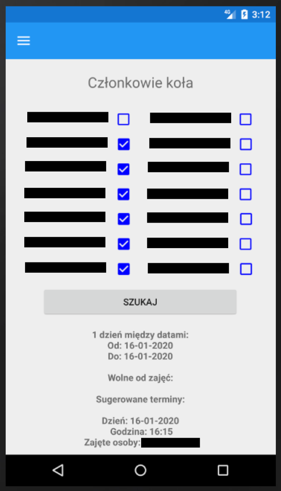

# dotnetapp

Głównym zadaniem aplikacji jest automatyczne ustalanie terminów spotkań członków grupy .NET na podstawie planów zaimportowanych z systemu e-dziekanat. Docelowym urzadzeniem jest telefon z systemem Android. Jednym z najwazniejszych punktów jest procedura planowania spotkań.

### Wymagania funkcjonalne
**Wymaganie 1** \
Mozliwosc wyboru interesujacego nas przedziału czasowego, poszukiwanego
terminu spotkania. \
**Wymaganie 2** \
Mozliwosc okreslenia/wybrania uczestników spotkania (ale tylko sposród
członków koła), których chcielibysmy zaprosic na spotkanie. \
**Wymaganie 3**\
Mozliwosc wyswietlania listy wszystkich dostepnych terminów. Dostepny
termin, to taki termin w którym studenci nie maja zajec - sa wolni. \
**Wymaganie 4**\
Mozliwosc wyswietlania informacji o tym kto nie bedzie mógł wziac udziału
w spotkaniu i zwiazana z tym mozliwosc wskazania terminu, w którym moze
wziac udział jak najwiecej osób z listy.

### Wymagania niefunkcjonalne
**Wymaganie 1**\
System operacyjny Android. \
**Wymaganie 2** \
Aplikacja responsywna. \
**Wymaganie 3**\
Aplikacja nie przechowuje danych osobowych.\
**Wymaganie 4**\
Aplikacja łaczy sie z systemem e-dziekanat aby pobrac plany.

### Technologie:
- Android
- Xamarin
- XAML
- C#

## Screeny:

## Strona główna

## Menu aplikacji

## Szukanie wolnego terminu

## Rezultat znalezienia wolnego terminu

## Rezultat braku wolnych terminow

